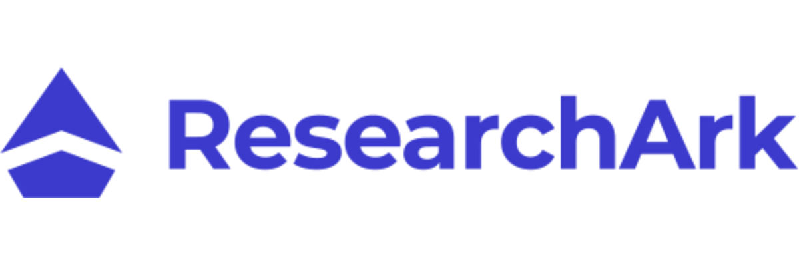
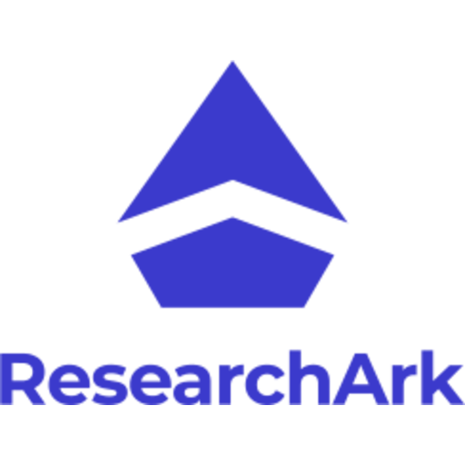

<div align="center">



### The World's First AI-native Research Excellence Ecosystem

[](https://researchark.eu)
[](https://researchark.eu)
[](https://mycel-ai.de)

</div>

---

## A world where scientific discovery thrives without administrative friction

Where AI amplifies human ingenuity, democratic collaboration accelerates breakthroughs, and every idea with merit finds the resources to create measurable impact.

---

## The Ark Ecosystem

Seven AI-native modules that transform how you discover funding, develop proposals, build partnerships, manage identity, accelerate discovery, orchestrate programs, and cultivate communities.

| Module | Tagline | Description |
|:------:|:--------|:------------|
| **ArkSearch** | AI-native Funding Discovery | Precision pathways to optimal funding. Discover research funding opportunities with AI-native search, advanced filtering, bio-based matching, and intelligent recommendations. |
| **ArkAssist** | AI-native Proposal Development | From concept to compelling proposals. Get intelligent support for grant applications, eligibility analysis, budget planning, and compliance checking. |
| **ArkSphere** | Open Innovation Partnerships | Building brilliant research teams. Open, inclusive platform connecting researchers, startups, SMEs, and innovators—enabling democratic consortium building and collaborative breakthroughs. |
| **ArkID** | Universal Research Identity | Unifying the research identity continuum. Universal identity and trust system with standardized identifiers (ARKI, ARKU, ARKP, ARKO, ARKD, ARKF) for researchers, institutions, and projects. |
| **ArkLab** | Ethical Autonomous Scientific Discovery | Amplifying human intellect through AI partnership. Researcher Workbench with Git-compatible version control, AI-native co-scientists, and Self-Driving Lab OS for autonomous experimentation. |
| **ArkNexus** | Vision to Impact Program Platform | Orchestrating innovation excellence from vision to impact. End-to-end RTDI program management covering strategic planning, call creation, evaluation, implementation, and impact assessment. |
| **ArkConnect** | Cultivating Innovation Beyond Funding Horizons | Transform temporary research collaborations into thriving knowledge communities that persist beyond project timelines. |

---

## Measurable Impact

<table>
<tr>
<td width="50%">

### For Researchers & Innovators

- **Find funding 8–13× faster** — ArkSearch's AI-powered discovery identifies best fits in minutes, not days
- **Write proposals 15–25% faster** — ArkAssist guides development while you maintain creative control
- **Accelerate experiments up to 10× faster** — ArkLab's AI co-scientist optimizes workflows
- **Build dream teams instantly** — ArkSphere connects you to active projects and researchers globally

</td>
<td width="50%">

### For Funders & Institutions

- **Make decisions 53–65% faster** — ArkNexus streamlines review from call creation to selection
- **Track impact in real-time** — Automatically connect awards to publications, patents, and outcomes
- **Build trusted communities** — Transform projects into lasting innovation ecosystems
- **Fund the best science** — Evaluation frameworks reduce bias and improve outcomes

</td>
</tr>
</table>

<sub>Evidence from JAMA Network Open 2024-2025, UK Metascience Unit DPR 2025, SLAC facility automation 2024, NSF NAIRR Pilot 2024-2025</sub>

---

## Our Mission

To accelerate global scientific progress by creating the world's first AI-native research excellence ecosystem. Integrating intelligent funding discovery, proposal development, collaborative research, and impact assessment into one unified platform that empowers researchers to focus on breakthrough science, innovators to transform ideas into reality, and funders to maximize the impact of every innovation investment.

---

## Technology

```
Frontend       → Next.js 15 • React 19 • TypeScript • Tailwind CSS
Backend        → FastAPI • Express.js • Python 3.12 • Node.js 22
AI/ML          → PyTorch • spaCy • Sentence Transformers • Multi-LLM Integration
Data           → PostgreSQL 17 • Weaviate (Vector DB) • Redis
Infrastructure → Docker • Celery • Firebase Auth
```

---

## Core Principles

| Principle | Description |
|:----------|:------------|
| **Integration over Fragmentation** | Creating a seamless digital environment where information, processes, and collaborations flow naturally |
| **Intelligence over Administration** | Embedding AI throughout to shift from administrative burden to intelligent assistance |
| **Collaboration over Competition** | Breaking down institutional silos to enable democratic collaboration across disciplines and geographies |
| **Impact over Outputs** | Moving beyond traditional metrics to comprehensive understanding of real-world impact |

---

<div align="center">

| Links | |
|:-----:|:--|
| **Platform** | [researchark.eu](https://researchark.eu) |
| **Company** | [Mycel AI](https://mycel-ai.de) |
| **Contact** | [info@researchark.eu](mailto:info@researchark.eu) |

---

*Empowering researchers. Accelerating discovery. Building the future of science.*

<br>



<sub>Built with passion in Germany by <a href="https://mycel-ai.de">Mycel AI</a></sub>

</div>
